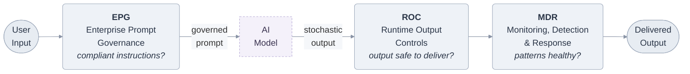

# Trust by Design: Governing Enterprise AI with Clad

**Hard boundaries. Formal proof.**

*The governance layer for regulated AI.*

Trust by Design collects the Clad framework — meta-framework, prompt governance, runtime output controls, monitoring, and regulatory crosswalks — into a single ordered book. See [SUMMARY.md](SUMMARY.md) for the full table of contents and reading order.

---

Enterprises are deploying AI with no governance that survives regulatory scrutiny. Prompts are ad-hoc, outputs are unfiltered, and audit trails are incomplete. When a regulator asks *"show me exactly which rules governed this AI interaction"* — most organizations have no answer.

Clad is a formally modeled governance framework that provides hierarchical constraints, tamper-evident audit trails, and regulatory crosswalks for enterprise AI under HIPAA, SOX, GLBA, NERC CIP, GDPR, and the EU AI Act.

## The Three-Layer Pipeline



Each layer produces tamper-evident, version-stamped audit records that compose into a complete chain.

## Formal Verification

**Clad's governance logic is mathematically proven correct and independently verified against the production code.**

The framework includes 76 machine-checked theorems in [Lean 4](https://lean-lang.org/) with zero `sorry` (no unfinished proofs). The proofs cover every master theorem from the formal specifications:

- **Composition algebra** -- components form a commutative monoid (Theorem 6)
- **Surface completeness** -- EPG + ROC + MDR covers all five control surfaces (Theorem 1)
- **Tamper-evident audit chains** -- hash-chain integrity with tamper detection (Theorem 3a)
- **Ghost detection** -- every interaction is classified as governed, degraded, or ghost (Theorem 3b)
- **Deontic logic** -- obligation/prohibition satisfaction semantics with 4 inversion rules
- **Constraint hierarchy monotonicity** -- enterprise constraints propagate to all lower levels
- **Residual risk reduction** -- adding components monotonically reduces risk (Theorem 4)
- **Contract composability** -- independently deployed components preserve guarantees (Theorem 2)
- **Output evaluation** -- deterministic threshold decisions with exhaustive coverage
- **Audit completeness** -- every governed interaction produces an audit record (Theorem 5)
- **Failure semantics** -- fail-closed/fail-open posture is a bijection over actions

**Differential testing.** Following the [AWS Cedar](https://www.amazon.science/publications/cedar-a-new-language-for-expressive-fast-safe-and-analyzable-authorization) pattern, the Lean model includes an executable evaluator (`clad-difftest`) that is tested against the Scala production engine on 1,000+ randomly generated constraint hierarchies, detection states, and evaluation contexts. Zero mismatches. This is the same methodology Cedar uses to verify its Rust authorization engine against a Lean specification -- applied here to AI governance for the first time.

**Release gate.** No version of Clad ships unless the Lean proofs compile and all differential tests pass.

*Proven correct. Tested against production. Every release.*

See [`lean/`](lean/) for the full proof library and build instructions.

## What Makes This Different

- **Formal rigor with honest limitations.** Deontic logic, algebraic composition, and formal proofs — with explicit statements of what it guarantees and what it doesn't. Every theorem has preconditions. Every component has a limitations section.
- **Composable, independently deployable components.** Start with prompt governance, add output controls when ready, layer on monitoring as you mature. Formal proof of component independence (Theorem 6).
- **Designed for regulated industries.** Not generic "AI ethics." Specific regulatory crosswalks for HIPAA, SOX, GLBA, NERC CIP, the EU AI Act, and NIST AI RMF.
- **Constraints, not prescriptions.** Like building codes for AI — Clad defines properties your prompts and outputs must satisfy, not how to write them.

## Quick Start

Evaluate a prompt against your governance constraints via the REST API:

```bash
curl -X POST http://localhost:8080/api/v1/evaluate \
  -H "Content-Type: application/json" \
  -d '{
    "prompt": "Summarize the patient discharge notes for Dr. Smith",
    "metadata": {"department": "clinical", "project": "discharge-summary"}
  }'
```

Response:

```json
{
  "allSatisfied": false,
  "totalConstraints": 5,
  "satisfiedCount": 4,
  "unsatisfied": [
    {
      "property": "phi-disclosure-prohibition",
      "constraintType": "prohibition",
      "level": "enterprise"
    }
  ],
  "auditDigest": "sha256:a1b2c3..."
}
```

Or use the MCP server for AI-agent integration:

```bash
echo '{"jsonrpc":"2.0","method":"tools/call","params":{"name":"clad_evaluate_prompt","arguments":{"prompt":"Summarize patient notes"}},"id":1}' | \
  sbt "mcp/run -- --config governance.json"
```

## Modules

| Module | Description |
|--------|-------------|
| **core** | Domain model — Level, Constraint (Obligation/Prohibition), PropertyId, Surface, Component composition |
| **evaluation** | Prompt evaluator — mechanical (keyword/regex/structural checkers) and procedural (human attestation) |
| **runtime** | GovernanceEngine — builds from config, evaluates prompts, produces audit records |
| **audit** | Signed hash-chained audit records, append-only file storage, verification |
| **output** | Output evaluator — deterministic rules + classifier scoring, Pass/Flag/Block pipeline |
| **integrity** | SupervisedEngine — fail-closed/fail-open posture, GIL, degraded-mode handling |
| **monitoring** | Event detection (per-event + sliding window), alert taxonomy (P1-P4), EventBus |
| **config** | JSON config loading, engine construction, RBAC constraint authorization |
| **api** | HTTP REST API — evaluate, output evaluate, config, constraints, reload, health |
| **mcp** | MCP server — JSON-RPC over stdin/stdout, 6 governance tools |

## Build & Test

Requires Scala 3.3.7 and sbt 1.10.7.

```bash
cd code
sbt compile                    # compile all modules
sbt test                       # run all tests (91 source files, 60 test files)
sbt "core-test/testOnly clad.core.ConstraintSpec"  # run a single test
```

See [docs/architecture.md](docs/architecture.md) for the full module dependency graph and domain type reference.

## Research Documents

The formal specifications that the code implements:

| Document | Description |
|----------|-------------|
| [Section 1 — The Architecture of Assurance: Clad's Meta-Framework](research/meta-framework.md) | 5 axioms, 6 theorems, control surface model, threat model (T1-T11), enforcement architecture, failure semantics, audit integrity, composition algebra |
| [Section 2 — Responsible Prompting: Policies That Let Teams Move Fast, Safely (EPG)](research/wp1-enterprise-prompt-governance.md) | Hierarchical constraints (enterprise ≻ department ≻ project), RBAC, evaluability decomposition, conflict resolution, domain isolation |
| [Section 3 — Stopping Bad Outputs: Runtime Controls and Fallbacks (ROC)](research/wp2-runtime-output-controls.md) | Two-tier hybrid evaluation (deterministic + classifier), risk-tiered pipeline, threat-specific controls |
| [Section 4 — Seeing the Whole Picture: MDR — Monitoring, Detection, Response](research/sa-monitoring-detection-response.md) | Cross-component monitoring, incident response, forensic evidence preservation |
| [Section 5 — Meeting Regulators: Practical Mapping to Key Standards](research/regulatory-mapping-appendix.md) | Crosswalk to NIST AI RMF, EU AI Act, ISO 42001, HIPAA, SOX, GLBA, NERC CIP |

## Read the book

The research documents are also published as the ebook **_Trust by Design: Governing Enterprise AI with Clad_**:

- **EPUB / PDF** — <!-- TODO: replace with your GitHub Pages or Releases URL --> _(publish link TBD)_
- **Landing page** — a single-page site lives in [`landing/`](landing/) and deploys to Google Cloud Storage; see [`gcp/README.md`](gcp/README.md). _(public URL TBD after first deploy)_

## Validation Status

This framework has been developed through formal design and multi-model adversarial review. It has **not** been validated through production deployment or empirical testing. The formal properties are architecturally sound but operationally unverified. Pilot deployment with representative workloads is recommended before enterprise rollout.

## License

- **Code** ([`code/`](code/)): [MIT License](LICENSE-CODE.md)
- **Research & Docs** ([`research/`](research/), [`docs/`](docs/)): [CC BY 4.0](LICENSE-DOCS.md)

## Author

David Callaghan — [LinkedIn](https://linkedin.com/in/davecallaghan)

*By [2CData](https://2cdata.com)*
