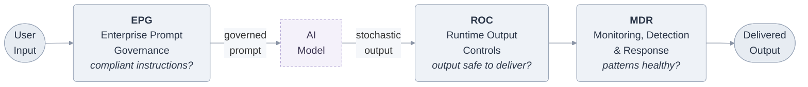
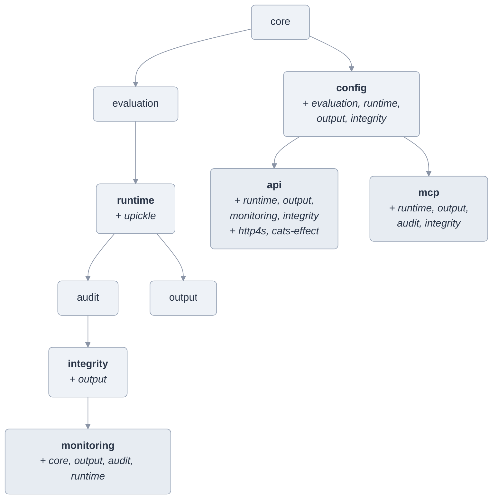

# Clad Architecture

Clad implements a three-layer governance pipeline for AI systems in regulated industries. Each layer is independently deployable and produces tamper-evident audit records.

## The Pipeline



## Module Dependency Graph



## Key Domain Types

- **Level** — `Enterprise | Department | Project`. Enterprise constraints override all others (monotonicity).
- **Constraint** — `Obligation(property, level)` or `Prohibition(property, level)`. Deontic operators over `PropertyId`.
- **Surface** — `Prompt | Input | Config | Output | Delivery`. The five control surfaces.
- **Component** — `EPG | ROC | MDR`. Composable via `⊕` (commutative monoid with disjoint surface requirement).
- **PropertyChecker** — Trait for mechanical evaluation. Implementations: `KeywordChecker`, `RegexChecker`, `StructuralChecker`, `CompositeChecker`.

## Build & Test

Requires Scala 3.3.7 and sbt 1.10.7.

```bash
cd code
sbt compile          # compile all modules
sbt test             # run all tests
sbt "core-test/test" # run tests for a single module
sbt "core-test/testOnly clad.core.ConstraintSpec"  # run a single test class
```

## Tech Stack

| Component | Technology |
|-----------|-----------|
| Language | Scala 3.3.7 |
| Build | sbt 1.10.7 |
| Testing | ScalaTest + ScalaCheck (property-based) |
| HTTP API | http4s (Ember server) + Cats Effect |
| Serialization | uPickle |
| MCP Server | JSON-RPC over stdin/stdout |
